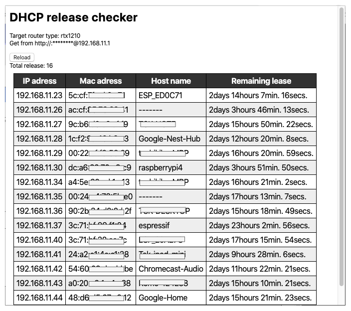
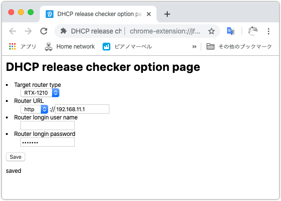

# chrome_extension_yamaha_dhcp_status
This extension get dhcp release status from yamaha RTX810 or RTX1210

* Extension options page

  

## install

1. Enable extension developer mode
2. Clone this git repository
3. Load the unpackaged extension, select the directory of the cloned repository
4. Register the router's IP address, password, etc. from the extension option menu

